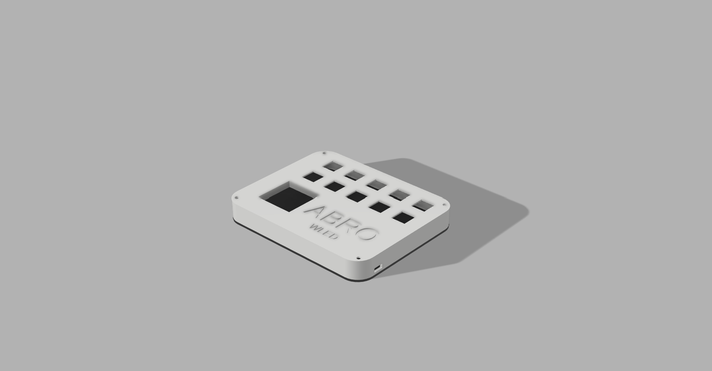
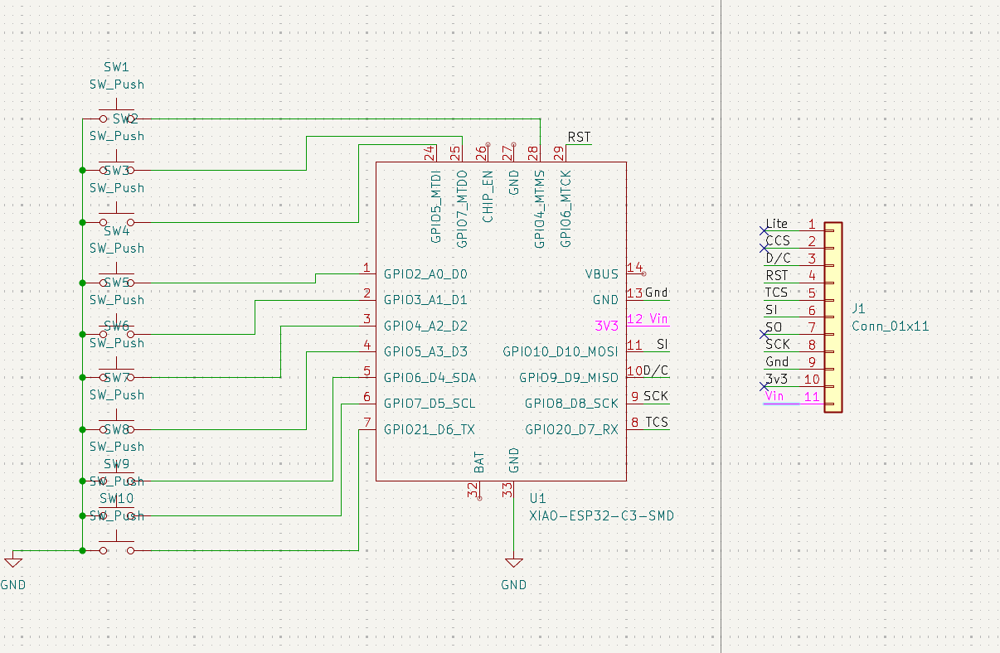
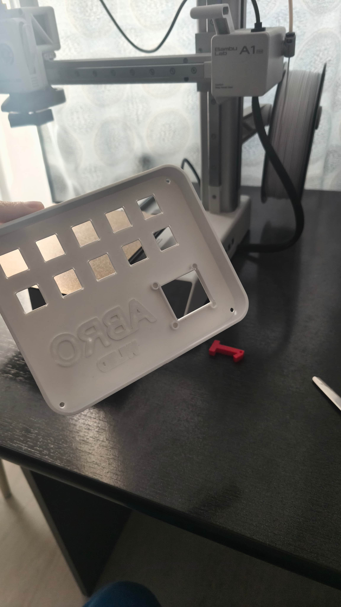
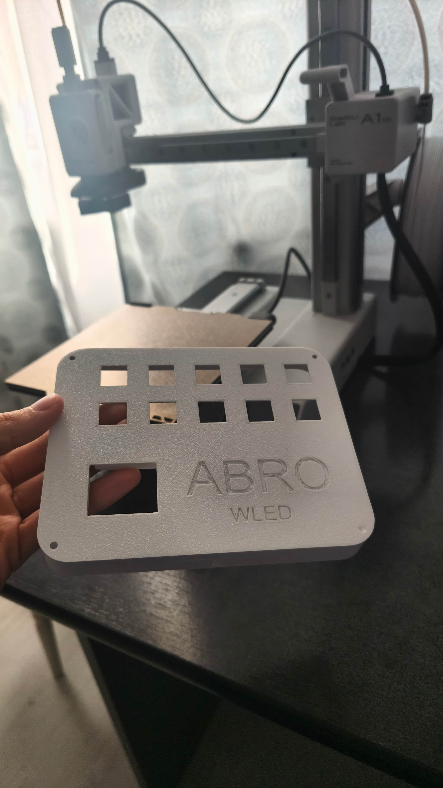
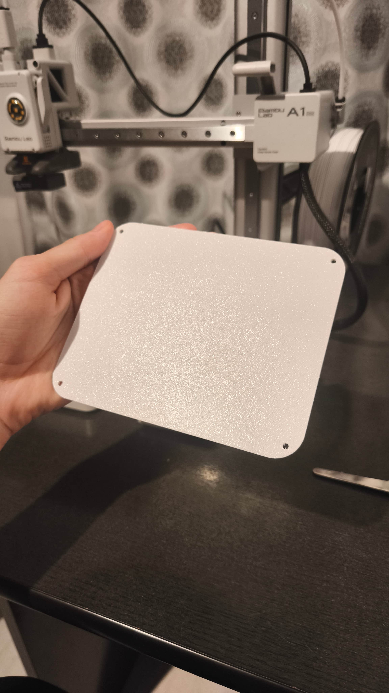
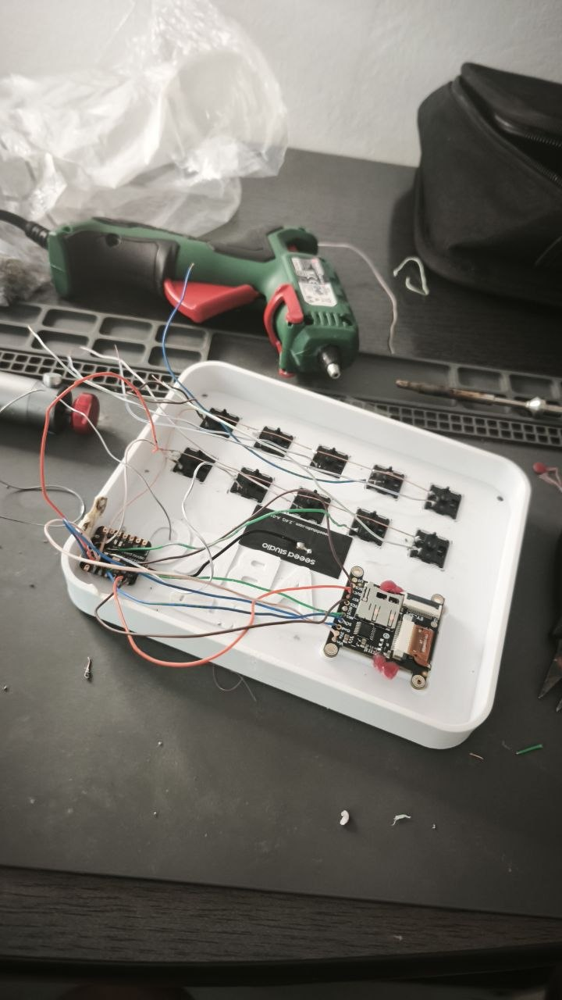
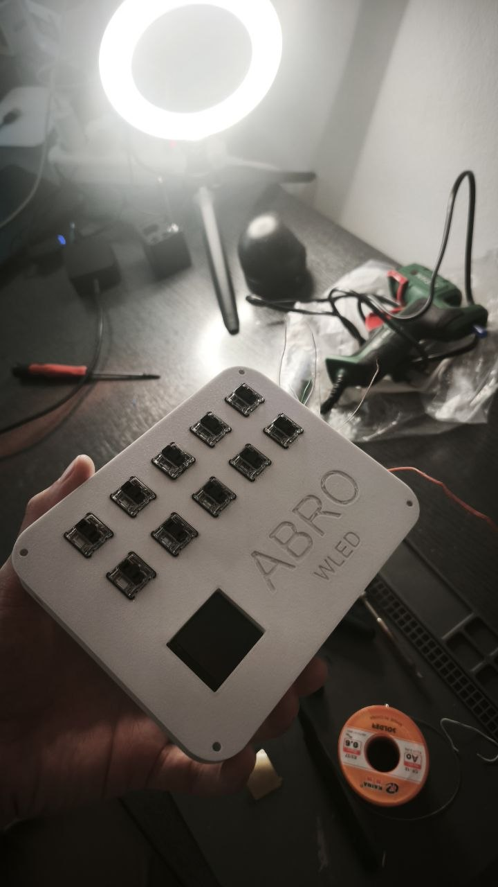

# WLED Remote Project

A custom controller featuring a display and 9 physical buttons designed for remote WLED control. This basic device allows for dynamic color mixing.

## Project Overview
The goal of this project is to create an intuitive hardware interface where buttons function as color components, allowing users to "mix" light in real-time.

### Operational Logic
The LEDs' color changes dynamically based on button combinations:
* **Red Button:** LEDs turn red.
* **Green Button:** LEDs turn green.
* **Red + Green Combination:** LEDs display a mix of red and green (Yellow/Orange).
* **Adding Yellow:** The output becomes a mix of red, green, and yellow components.
* **Removing a Component:** For example, removing red from a mix leaves the LEDs with the remaining active colors (e.g., Green and Yellow).

## Hardware Specifications
The project is built using the following core components:

| Component | Description | Price | Link |
| :--- | :--- | :--- | :--- |
| **Seeed Studio XIAO ESP32-C3** | RISC-V microcontroller, WiFi + BT 5.0, 4MB Flash, 160MHz | $14.48 | [Link](https://www.skroutz.ro/s/56684969/Seeed-Xiao-Esp32c3.html) |
| **ST7789 LCD Display** | 1.3" TFT LCD, 240x240 resolution, microSD slot | $33.25 | [Link](https://robofun.ro/lcd/afisaj-tft-lcd-adafruit-3-3cm-240x240-microsd-st7789.html) |

## Development Progress & Milestones

### 1. 3D Design & Modeling
The enclosure design is complete. It was engineered to the ST7789 display, and the 9 button.

### 2. Electronics & Wiring
The circuit design and wiring diagram are nearly finished. This involves mapping the button matrix and display to the ESP32-C3 GPIOs.

### 3. 3D Development Progress

| Internal View | Outside View | Model Button |
| :--- | :--- | :--- |
|  |  |  |
### Printing Process
The prototype was manufactured with a 0.2mm layer height. The video below shows the printing process based on the `printing_template`:

**Printing Timelapse:**

## Installation & Usage

| Connecting to Esp | From the Front |
| :--- | :--- |
|  *I added the ESP and wired up the screen and the buttons.* |  *This is what the project looks like from the front.* |

[Changing the LED (video)](Videos/changing_the_led.mp4)

*This is how the results looks like.*
---
